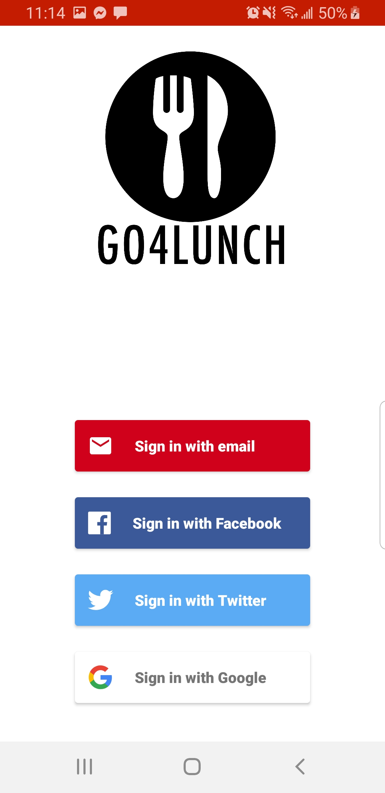
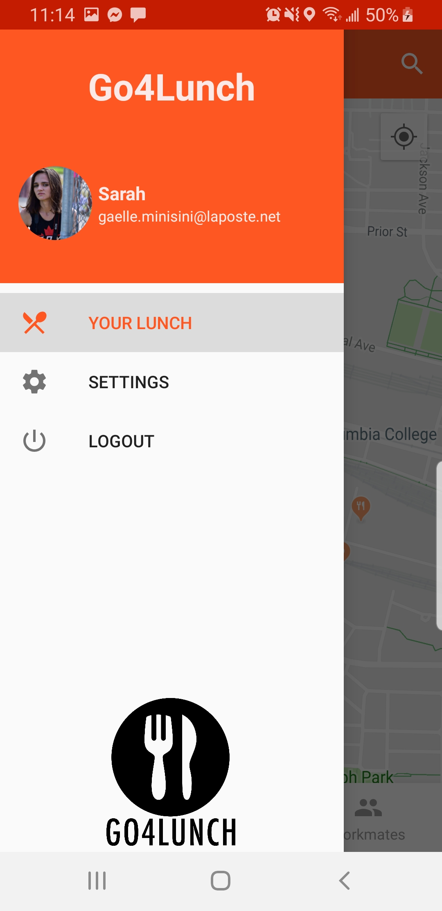
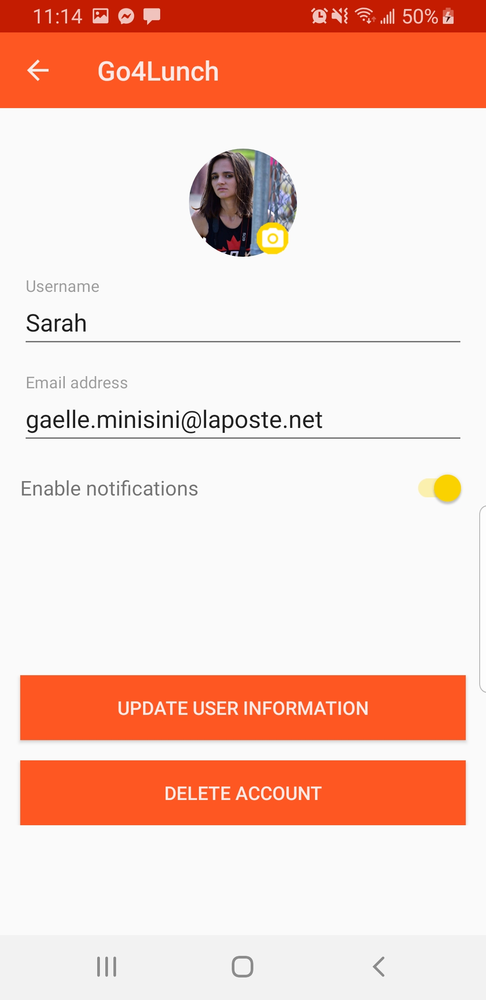
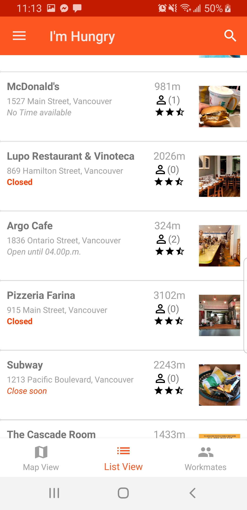
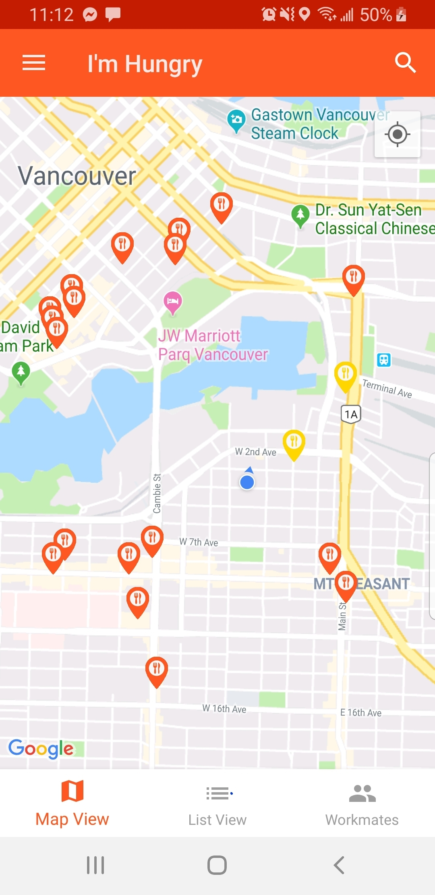
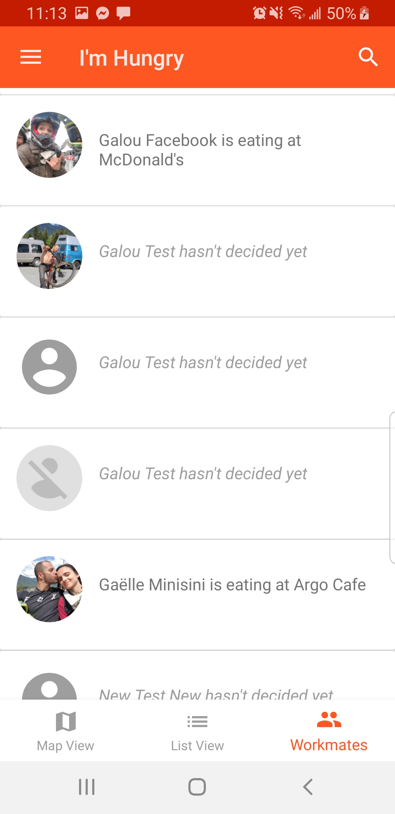
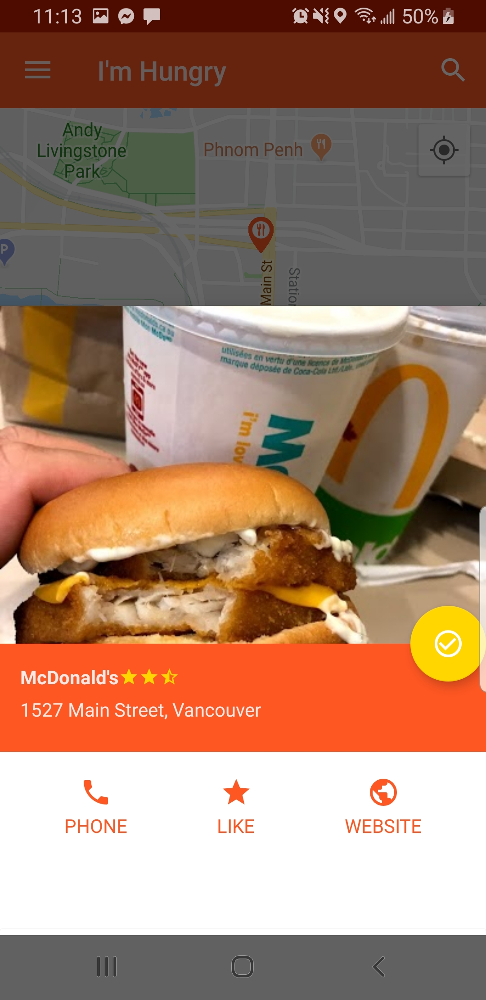
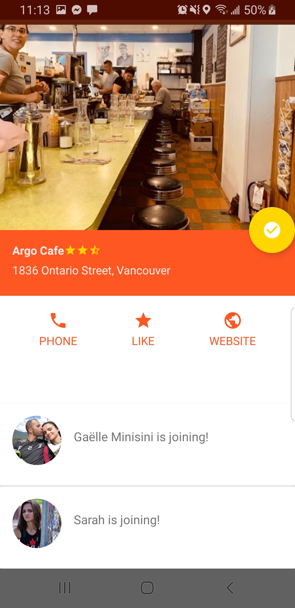
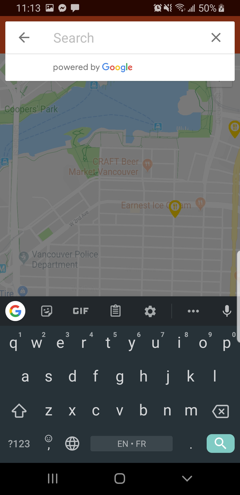

# Go4Lunch
-------------
An Android App to find a place to eat lunch with your coworker.

You can: 
* Visualize the restaurants around you on a map or on a list
* Display the details of each restaurant and call them directly to book a table
* See where your cowrker wants to eat
* Pick a restaurant for todays' lunch

You will be remembered everyday at noon where you are going to eat and who is coming with you

&ensp;
&ensp;&ensp;
&ensp;

## Library
* [Android Support Library](https://developer.android.com/topic/libraries/support-library/)
* [Glide](https://github.com/bumptech/glide/)
* [Gson](https://github.com/google/gson/)
* [ButterKnife](https://jakewharton.github.io/butterknife/)
* [Retrofit](https://square.github.io/retrofit/)
* [RxJava](https://github.com/ReactiveX/RxJava)
* [Cloud Firestore](https://firebase.google.com/docs/firestore)
* [Firebase Authentification](https://firebase.google.com/docs/auth)
* [Cloud Storage](https://firebase.google.com/docs/storage)
* [Facebook Android SDK](https://developers.facebook.com/docs/android/)
* [Twitter Android SDK](https://developer.twitter.com/en/docs/developer-utilities/twitter-libraries)
* [Maps Android SDK](https://developers.google.com/maps/documentation/android-sdk/intro)
* [Place Android SDK](https://developers.google.com/places/android-sdk/intro)
* [Easy Permissions](https://github.com/googlesamples/easypermissions)
* [Mockito](https://site.mockito.org/)
* [Espresso](https://developer.android.com/training/testing/espresso)

## API
* [Google Map API](https://maps.googleapis.com)

## App Architecture
* MVVM
* databinding
* Java

## Developed By

Galou Minisini

    Copyright 2018 Galou Minisini
